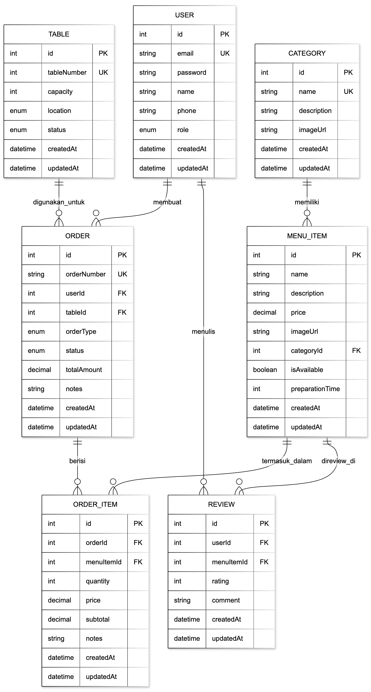

# DESAIN DATABASE - SISTEM MANAJEMEN RESTORAN

## Diagram Entity Relationship (ER Diagram)



**Keterangan Simbol:**
- `PK` = Primary Key (Kunci Utama)
- `FK` = Foreign Key (Kunci Asing)
- `UK` = Unique Key (Kunci Unik)
- Garis relasi menunjukkan hubungan antar tabel

---

## DETAIL ENTITAS

### 1. USER (Pengguna)
**Tujuan:** Menyimpan akun pengguna (pelanggan, staff, dan admin)

| Field      | Tipe         | Constraint           | Deskripsi                           |
|------------|--------------|----------------------|-------------------------------------|
| id         | Integer      | PK, Auto Increment   | Identifier unik pengguna            |
| email      | String       | UNIQUE, NOT NULL     | Email pengguna (kredensial login)   |
| password   | String       | NOT NULL             | Password terenkripsi (bcrypt)       |
| name       | String       | NOT NULL             | Nama lengkap pengguna               |
| phone      | String       | NULLABLE             | Nomor telepon kontak                |
| role       | Enum         | NOT NULL, DEFAULT    | CUSTOMER, STAFF, ADMIN              |
| createdAt  | DateTime     | NOT NULL             | Timestamp pembuatan akun            |
| updatedAt  | DateTime     | NOT NULL             | Timestamp update terakhir           |

**Relasi:**
- ONE-TO-MANY → Order (satu user dapat memiliki banyak order)
- ONE-TO-MANY → Review (satu user dapat menulis banyak review)

---

### 2. CATEGORY (Kategori Menu)
**Tujuan:** Mengorganisir menu items ke dalam kategori

| Field       | Tipe         | Constraint           | Deskripsi                           |
|-------------|--------------|----------------------|-------------------------------------|
| id          | Integer      | PK, Auto Increment   | Identifier unik kategori            |
| name        | String       | UNIQUE, NOT NULL     | Nama kategori (contoh: Dessert)     |
| description | String       | NULLABLE             | Deskripsi kategori                  |
| imageUrl    | String       | NULLABLE             | URL gambar kategori                 |
| createdAt   | DateTime     | NOT NULL             | Timestamp pembuatan                 |
| updatedAt   | DateTime     | NOT NULL             | Timestamp update terakhir           |

**Relasi:**
- ONE-TO-MANY → MenuItem (satu kategori memiliki banyak menu items)

**Aturan Bisnis:**
- Tidak bisa hapus kategori yang masih memiliki menu items
- Nama kategori harus unik

---

### 3. MENU_ITEM (Item Menu)
**Tujuan:** Menyimpan item menu restoran beserta detailnya

| Field           | Tipe         | Constraint           | Deskripsi                            |
|-----------------|--------------|----------------------|--------------------------------------|
| id              | Integer      | PK, Auto Increment   | Identifier unik menu item            |
| name            | String       | NOT NULL             | Nama menu item                       |
| description     | String       | NOT NULL             | Deskripsi item                       |
| price           | Decimal      | NOT NULL             | Harga saat ini (IDR)                 |
| imageUrl        | String       | NULLABLE             | URL gambar item                      |
| categoryId      | Integer      | FK, NOT NULL         | Referensi ke Category                |
| isAvailable     | Boolean      | NOT NULL, DEFAULT    | Flag ketersediaan (default: true)    |
| preparationTime | Integer      | NOT NULL             | Waktu persiapan dalam menit          |
| createdAt       | DateTime     | NOT NULL             | Timestamp pembuatan                  |
| updatedAt       | DateTime     | NOT NULL             | Timestamp update terakhir            |

**Relasi:**
- MANY-TO-ONE → Category (banyak items termasuk dalam satu kategori)
- ONE-TO-MANY → OrderItem (satu item dapat ada di banyak order)
- ONE-TO-MANY → Review (satu item dapat memiliki banyak review)

**Aturan Bisnis:**
- Harga: minimal 1.000 IDR, maksimal 10.000.000 IDR
- Waktu persiapan: 1-180 menit
- Harus termasuk dalam satu kategori

---

### 4. TABLE (Meja Restoran)
**Tujuan:** Mengelola meja-meja restoran

| Field       | Tipe         | Constraint           | Deskripsi                           |
|-------------|--------------|----------------------|-------------------------------------|
| id          | Integer      | PK, Auto Increment   | Identifier unik meja                |
| tableNumber | Integer      | UNIQUE, NOT NULL     | Nomor meja                          |
| capacity    | Integer      | NOT NULL             | Kapasitas tempat duduk (1-20)       |
| location    | Enum         | NOT NULL             | INDOOR, OUTDOOR, VIP                |
| status      | Enum         | NOT NULL, DEFAULT    | AVAILABLE, OCCUPIED, RESERVED       |
| createdAt   | DateTime     | NOT NULL             | Timestamp pembuatan                 |
| updatedAt   | DateTime     | NOT NULL             | Timestamp update terakhir           |

**Relasi:**
- ONE-TO-MANY → Order (satu meja dapat digunakan untuk banyak order)

**Aturan Bisnis:**
- Auto-update status: order DINE_IN dibuat → status OCCUPIED
- Order COMPLETED/CANCELLED → status AVAILABLE
- Kapasitas: minimal 1, maksimal 20 orang

---

### 5. ORDER (Pesanan)
**Tujuan:** Menyimpan pesanan pelanggan

| Field        | Tipe         | Constraint           | Deskripsi                              |
|--------------|--------------|----------------------|----------------------------------------|
| id           | Integer      | PK, Auto Increment   | Identifier unik order                  |
| orderNumber  | String       | UNIQUE, NOT NULL     | Format: ORD-YYYYMMDD-XXXX              |
| userId       | Integer      | FK, NOT NULL         | Referensi ke User                      |
| tableId      | Integer      | FK, NULLABLE         | Referensi ke Table (untuk DINE_IN)     |
| orderType    | Enum         | NOT NULL             | DINE_IN, TAKEAWAY, DELIVERY            |
| status       | Enum         | NOT NULL, DEFAULT    | PENDING, CONFIRMED, PREPARING, dll     |
| totalAmount  | Decimal      | NOT NULL             | Total jumlah pembayaran (IDR)          |
| notes        | String       | NULLABLE             | Catatan order                          |
| createdAt    | DateTime     | NOT NULL             | Timestamp pembuatan order              |
| updatedAt    | DateTime     | NOT NULL             | Timestamp update terakhir              |

**Relasi:**
- MANY-TO-ONE → User (banyak order dimiliki oleh satu user)
- MANY-TO-ONE → Table (banyak order dapat menggunakan satu meja)
- ONE-TO-MANY → OrderItem (satu order berisi banyak items)

**Alur Status:**
```
PENDING → CONFIRMED → PREPARING → READY → COMPLETED
    ↓
CANCELLED
```

**Aturan Bisnis:**
- Order DINE_IN WAJIB memiliki tableId
- Order TAKEAWAY/DELIVERY: tableId = NULL
- Minimal 1 item dalam order
- totalAmount = jumlah dari semua OrderItem subtotal
- Tidak bisa skip status dalam workflow

---

### 6. ORDER_ITEM (Item Pesanan / Junction Table)
**Tujuan:** Menghubungkan order dengan menu items (relasi many-to-many)

| Field       | Tipe         | Constraint           | Deskripsi                           |
|-------------|--------------|----------------------|-------------------------------------|
| id          | Integer      | PK, Auto Increment   | Identifier unik order item          |
| orderId     | Integer      | FK, NOT NULL         | Referensi ke Order                  |
| menuItemId  | Integer      | FK, NOT NULL         | Referensi ke MenuItem               |
| quantity    | Integer      | NOT NULL             | Jumlah item (1-20)                  |
| price       | Decimal      | NOT NULL             | Snapshot harga saat order dibuat    |
| subtotal    | Decimal      | NOT NULL             | quantity × price                    |
| notes       | String       | NULLABLE             | Permintaan khusus                   |
| createdAt   | DateTime     | NOT NULL             | Timestamp pembuatan                 |
| updatedAt   | DateTime     | NOT NULL             | Timestamp update terakhir           |

**Relasi:**
- MANY-TO-ONE → Order (banyak items dalam satu order)
- MANY-TO-ONE → MenuItem (banyak order untuk satu menu item)

**Aturan Bisnis:**
- Harga di-snapshot (mencegah masalah jika harga menu berubah)
- Subtotal = quantity × price
- Cascade delete ketika order dihapus

---

### 7. REVIEW (Ulasan)
**Tujuan:** Ulasan pelanggan untuk menu items

| Field       | Tipe         | Constraint           | Deskripsi                           |
|-------------|--------------|----------------------|-------------------------------------|
| id          | Integer      | PK, Auto Increment   | Identifier unik review              |
| userId      | Integer      | FK, NOT NULL         | Referensi ke User                   |
| menuItemId  | Integer      | FK, NOT NULL         | Referensi ke MenuItem               |
| rating      | Integer      | NOT NULL             | Rating 1-5 bintang                  |
| comment     | String       | NULLABLE             | Komentar review (minimal 10 karakter) |
| createdAt   | DateTime     | NOT NULL             | Timestamp pembuatan review          |
| updatedAt   | DateTime     | NOT NULL             | Timestamp update terakhir           |

**Relasi:**
- MANY-TO-ONE → User (banyak review ditulis oleh satu user)
- MANY-TO-ONE → MenuItem (banyak review untuk satu item)

**Aturan Bisnis:**
- User HARUS memiliki order COMPLETED dengan menu item tersebut
- Satu user hanya bisa review satu menu item SEKALI
- Rating: integer 1-5
- Unique constraint pada (userId, menuItemId)

---

## RINGKASAN RELASI

### Relasi One-to-Many (6 relasi):
1. **User → Order**: Satu user memiliki banyak order
2. **User → Review**: Satu user menulis banyak review
3. **Category → MenuItem**: Satu kategori berisi banyak menu items
4. **Table → Order**: Satu meja digunakan untuk banyak order (dari waktu ke waktu)
5. **MenuItem → Review**: Satu menu item memiliki banyak review
6. **Order → OrderItem**: Satu order berisi banyak items

### Relasi Many-to-Many (1 relasi):
1. **MenuItem ↔ Order** (melalui junction table OrderItem)
   - Satu order dapat memiliki banyak menu items
   - Satu menu item dapat ada di banyak order

---

## INDEXES

Untuk performa query yang optimal:

- **User**: email (unique index)
- **Category**: name (unique index)
- **MenuItem**: (categoryId, name), price
- **Table**: (tableNumber - unique), status
- **Order**: (userId, orderNumber - unique, status, createdAt)
- **OrderItem**: (orderId, menuItemId)
- **Review**: (userId, menuItemId - composite unique), rating

---

## STRATEGI CASCADE DELETE

| Parent       | Child      | Strategi  | Alasan                                           |
|--------------|------------|-----------|--------------------------------------------------|
| Order        | OrderItem  | CASCADE   | Items adalah bagian dari order, hapus bersama    |
| User         | Order      | RESTRICT  | Cegah penghapusan user yang memiliki order       |
| User         | Review     | CASCADE   | Review adalah milik user                         |
| MenuItem     | OrderItem  | RESTRICT  | Cegah penghapusan item yang sudah di-order       |
| MenuItem     | Review     | CASCADE   | Review adalah untuk menu item                    |
| Category     | MenuItem   | RESTRICT  | Cegah penghapusan kategori yang sedang digunakan |
| Table        | Order      | RESTRICT  | Cegah penghapusan meja yang memiliki order       |

---

## UNIQUE CONSTRAINTS

1. **User.email** - Satu email per akun
2. **Category.name** - Satu nama kategori saja
3. **Table.tableNumber** - Satu nomor meja saja
4. **Order.orderNumber** - Satu nomor order saja
5. **Review (userId, menuItemId)** - Satu review per user per menu item

---

## DEFINISI ENUMS

```javascript
// Role pengguna
enum UserRole {
  CUSTOMER  // Dapat membuat order dan review
  STAFF     // Dapat mengelola order dan menu items
  ADMIN     // Akses penuh ke sistem
}

// Tipe order
enum OrderType {
  DINE_IN   // Makan di restoran (memerlukan tableId)
  TAKEAWAY  // Dibawa pulang
  DELIVERY  // Dikirim ke rumah
}

// Status order
enum OrderStatus {
  PENDING    // Baru dibuat, menunggu konfirmasi
  CONFIRMED  // Dikonfirmasi oleh staff
  PREPARING  // Dapur sedang menyiapkan
  READY      // Siap untuk diambil/disajikan
  COMPLETED  // Order selesai
  CANCELLED  // Order dibatalkan
}

// Lokasi meja
enum TableLocation {
  INDOOR   // Di dalam restoran
  OUTDOOR  // Di luar/teras
  VIP      // Ruang VIP
}

// Status meja
enum TableStatus {
  AVAILABLE  // Bebas digunakan
  OCCUPIED   // Sedang digunakan
  RESERVED   // Di-reserve untuk pelanggan
}
```

---

## ATURAN INTEGRITAS DATA

### 1. Snapshot Harga
- Ketika order dibuat, harga menu item di-copy ke OrderItem.price
- Mencegah masalah jika harga menu berubah setelah order dibuat

### 2. Validasi Order
- Order DINE_IN HARUS memiliki tableId
- Order TAKEAWAY/DELIVERY harus tableId = NULL
- Order harus memiliki minimal 1 OrderItem
- totalAmount harus sama dengan jumlah semua OrderItem subtotal

### 3. Validasi Review
- User harus memiliki minimal satu order COMPLETED yang berisi menu item tersebut
- Mencegah review palsu dari user yang tidak pernah memesan

### 4. Workflow Status
- Status order harus mengikuti alur yang sudah ditentukan
- Tidak bisa skip status (contoh: PENDING → READY tidak valid)
- Hanya order PENDING yang bisa dibatalkan oleh customer

---

## RINGKASAN LOGIKA BISNIS

### Hak Akses Berdasarkan Role

**CUSTOMER:**
- Membuat order untuk diri sendiri
- Melihat order milik sendiri saja
- Membatalkan order PENDING milik sendiri
- Me-review menu items yang sudah dipesan

**STAFF:**
- Melihat semua order
- Update status order (mengikuti workflow)
- Mengelola menu items (CRUD)
- Update status meja

**ADMIN:**
- Akses penuh ke semua fitur
- Mengelola kategori
- Menghapus order (hanya yang CANCELLED)
- Menghapus meja
- Menghapus review
- Melihat statistik

---

## ESTIMASI UKURAN TABEL (PRODUCTION)

| Tabel      | Estimasi Rows/Tahun | Catatan                          |
|------------|---------------------|----------------------------------|
| User       | 10.000+             | Pelanggan, staff, admin          |
| Category   | 10-20               | Relatif statis                   |
| MenuItem   | 100-500             | Item menu                        |
| Table      | 20-50               | Meja fisik                       |
| Order      | 100.000+            | Order harian terakumulasi        |
| OrderItem  | 300.000+            | ~3 items per order rata-rata     |
| Review     | 20.000+             | ~20% dari completed orders       |

---

**Desain Selesai:** 2025-12-06
**Terakhir Diupdate:** 2025-12-06
